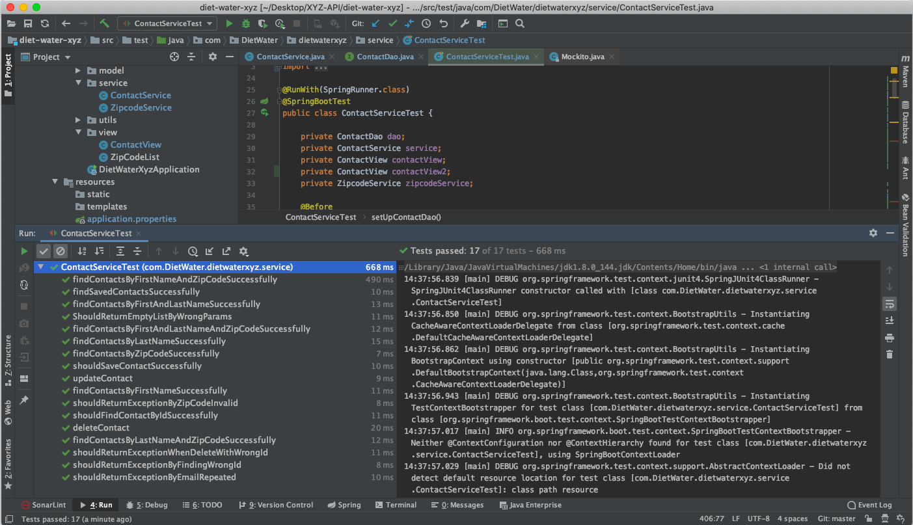

# XYZ-API
## Teksystems assessment
by Ethel Salazar | cel: (312) 522-1590 | email: salazarethel3010@gmail.com

## Settings

Under src > main > resources folder edit **application.properties** file, variable:
```
api.key.zipcode = p5dIK65I5qEQtN28zb8AjckxwzIQYlq4RDL2rrZi94gqBZPUmOpX6mUbJDUkzDIp
```
and provide a fresh API key value before launch and run this project (https://www.zipcodeapi.com/API#zipToLoc)

## Endpoints
### Endpoint name
```
http://localhost:8080/
```
### Endpoint name
```
http://localhost:8080/
```
### Endpoint name
```
http://localhost:8080/
```
### Endpoint name
```
http://localhost:8080/
```
### Endpoint name
```
http://localhost:8080/
```
## Test coverage


